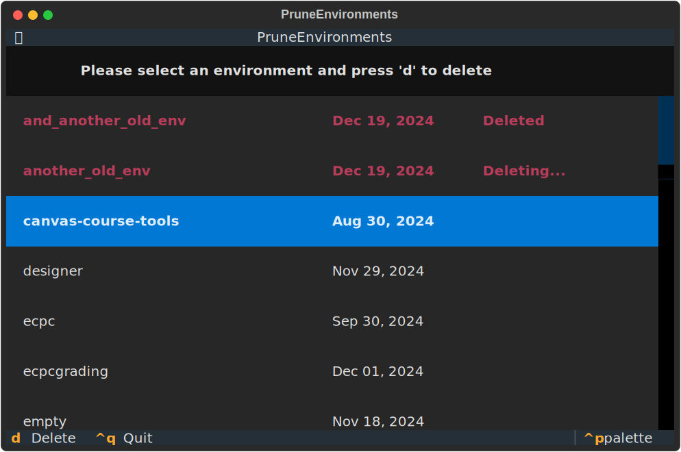

# Prune (conda) Environments

If you're a heavy user of conda environments there inevitably comes a time that you want to clean things up. Of course, you can use:
```
$ conda env remove -n my_old_env
```
for each and every environment you have lying around. You can also find out where your environments live and manually remove their folders.

Now, there is another way, using a TUI! 




## Installation and usage

You can install the application using `pipx`:
```
$ pipx install prune-envs
```
Of course, you can also use plain old `pip`. Start the application by typing:
```
$ prune-envs
```
Simply select an environment using the mouse or arrow keys and press 'D' to delete!